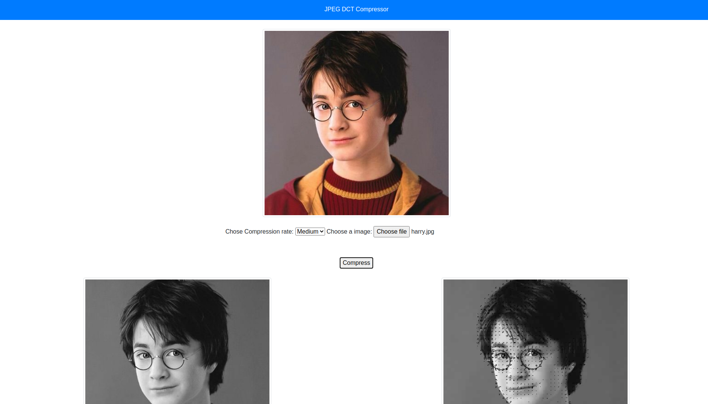
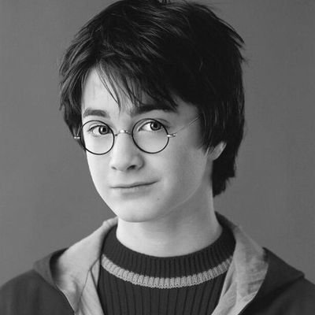
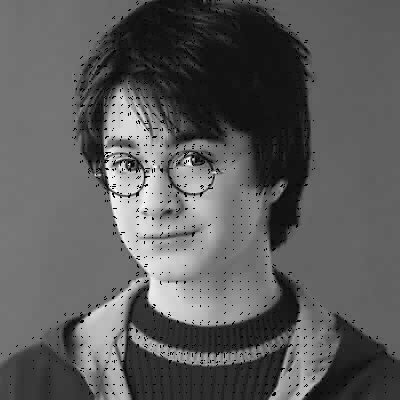

# JPEG-DCT-Compression
Standard jpeg compression with DCT with different compression rates

## Content

- [Pre-requisites](https://github.com/srijansingh53/jpeg-dct-compression#pre-requisites)
- [Run Locally](https://github.com/srijansingh53/jpeg-dct-compression#run-locally)
- [Results](https://github.com/srijansingh53/jpeg-dct-compression#results)
- [Conclusion](https://github.com/srijansingh53/jpeg-dct-compression#conclusion)

## Pre-requisites

Create a python3 virtual environment
```
python3 -m venv dct
source dct/bin/activate
```
Clone and install the dependencies for the project.
```
git clone https://github.com/srijansingh53/JPEG-DCT-Compression.git
cd jpeg-dct-compression/
pip install -r requirements.txt
```

## Run Locally

Run the following command to run locally on [localhost:5000](http://localhost:5000)
```
python app/app.py
```

## Results
The following are the images before and after compression

User Interface



Before



After




## Conclusion
- **3 types of compression is done - Q90(lowest), Q50(medium) and Q10(highest).**
- **Due to Quantization, artifacts are generated more for highly compressed images than lower compressed ones.**
- **DCT and IDCT code from scratch taking more time to process than openCV standard dct-idct functions.**

